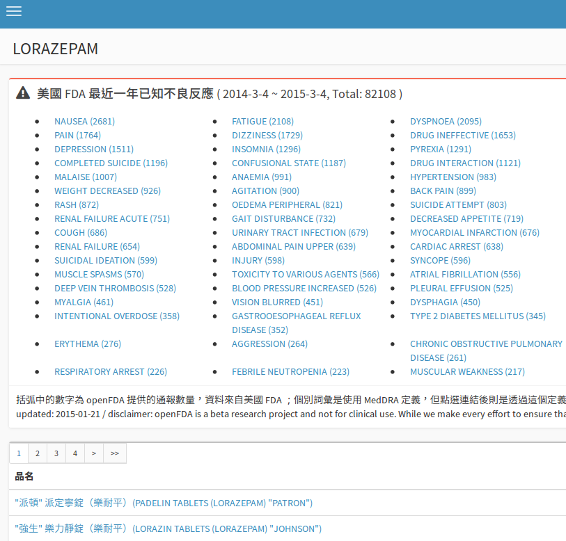

# 成份檢視介面說明

#### 不良反應資訊

如果是西藥成份，瀏覽時會即時查詢 openFDA 的不良反應資料庫，取得資料後內容會插入藥物清單上方。

在不良反應資訊區塊中，標題列會顯示資料起訖日期範圍，後面緊接著不良反應總通報數字；下方大量的列表則是不良反應的名稱，以及該不良反應的通報數量，可以從通報總數與個別不良反應的數量去計算比率。

openFDA 的資料中，個別詞彙是使用 MedDRA 定義，因為 MedDRA 是一個需要付費才能夠檢索的資料庫，所以沒辦法透過網路提供。透過網路有找到一個類似的資料庫 MeSH ，因為這個資料庫可以免費瀏覽，因此在點選個別詞彙時會進入這個系統查詢。

不良反應資訊有相當多模糊的地方，其一是使用的成份名稱不一定精確對應到預期的項目，因此取得的不良反應資訊僅供參考；其二則是透過 MedDRA 的詞彙去查詢 MeSH 說明頁面，這也是需要注意的地方，如果是醫事專業人員，如果對於個別詞彙有疑問，建議透過正式的 MedDRA 授權資料庫進行檢索，避免誤解。

#### 藥物一覽

在檢視個別成份時，下方會列出使用到該成份的所有藥物。

#### 留言板

畫面最下方是一個簡單的留言板，如果對這個成份有適合分享或討論的資訊歡迎善加運用。