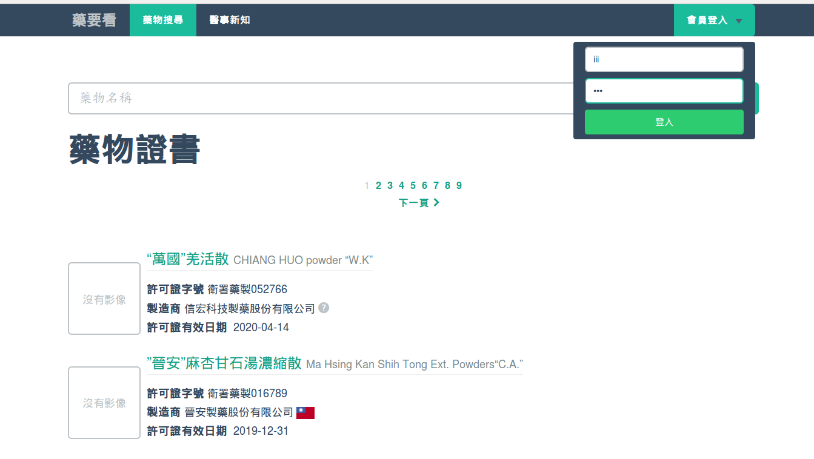
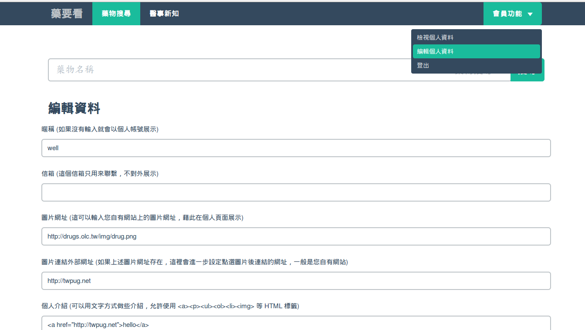
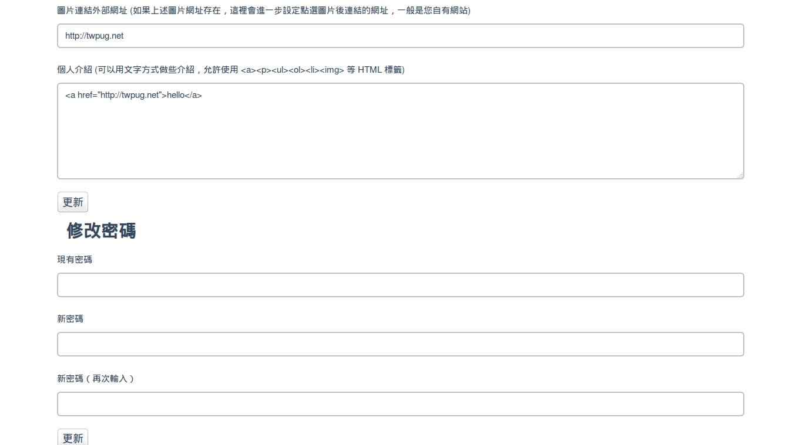
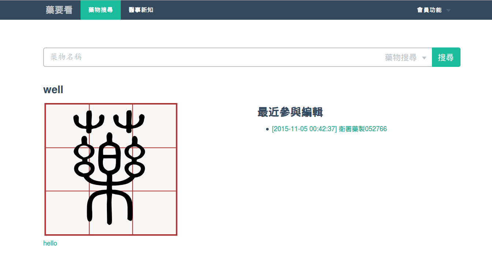

# 個人/機構資訊編輯

基於平等互惠原則，除了邀請參與編輯的內容會標示作者的署名外，藥要看網站進一步提供了額外的宣傳頁面，讓參與編輯的朋友可以藉此宣傳自己服務或開設的機構資訊。

## 登入藥要看網站

在取得帳號、密碼後，進入藥要看網站，在畫面右上角可以看到會員登入的連結，點選後會出現輸入帳號、密碼的欄位，將帳號、密碼填入後點選 "登入" 按鈕即可進入系統

登入系統後，原本會員登入表單的位置就會切換為會員相關功能，點選 "編輯個人資料" 即可開始進行編輯

編輯資料的欄位說明如下：
* **暱稱** 網站預設會使用登入的帳號作為作者標示，在這裡輸入暱稱資訊即可取代登入帳號顯示。
* **信箱** 在開立帳號時會以合約簽署的信箱輸入系統，如果未來希望調整聯絡的信箱，透過這個欄位更新即可
* **圖片網址** 如果已經存在自有代表圖示，可以直接輸入圖示所在位置的公開網址，在呈現個人頁面時會先呈現這裡輸入的圖片
* **圖片連結外部網址** 上述的圖片如果希望加入連結點選，可以直接在這個欄位輸入自有網站的網址，系統在呈現圖片時就會一併放入連結，訪客點選圖片後就會進入到自有網站
* **個人介紹** 如果針對自有機構或個人做些文字介紹，可以在此輸入文字。預設這裡的文字在呈現時會自動斷行，內容允許使用部份 HTML 標籤進行排版或連結，如果發現有不足之處歡迎與我們聯繫

在個人資訊表單下方就是修改密碼表單，建議在收到第一次隨機配發的密碼時就進行密碼的修改。修改密碼的方式就是輸入原有的密碼，以及在下方兩個欄位輸入新密碼，兩次輸入是希望能夠確認密碼的輸入沒有錯誤。

完成上述編輯後，請記得點選 "更新" 按鈕，接著在會員功能點選 "檢視個人資料" 就可以看到編輯的成果。這個畫面是公開的，任何人在看到使用該帳號編輯的資料時都會出現連結，點選連結後就會看到這個畫面。