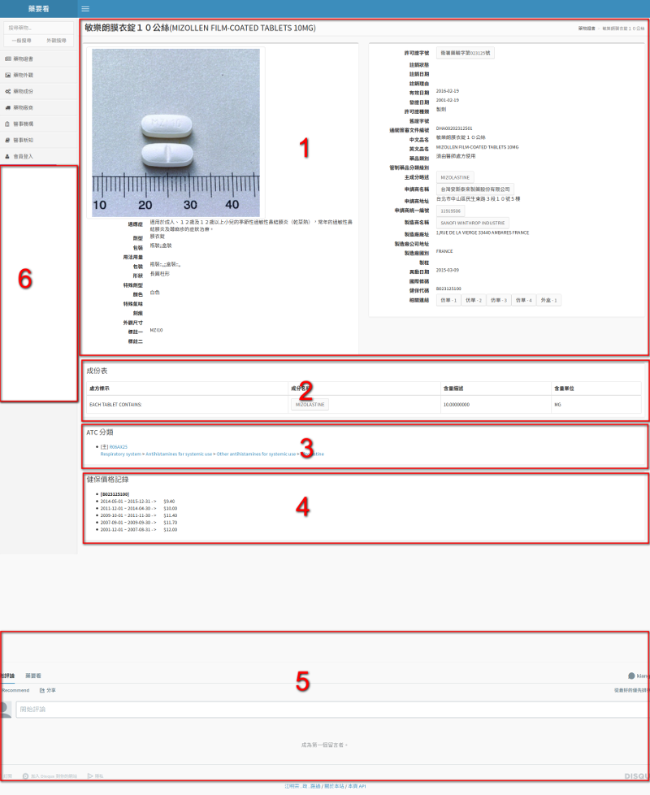

# 藥物檢視介面說明

進入個別藥物的頁面後會看到六個主要區域，以下說明各個區域的內容。

#### 區域 1 - 基本資訊

這裡包含藥物的基本資訊，其中有些欄位是可以進一步檢索的，說明如下：

* 許可證字號
> 如果是可以點選的狀態，點選後會開啟新視窗到食藥署頁面瀏覽；中藥並沒有類似介面可以使用
* 主成分略述
> 點選個別連結後會進入到該成份的檢視頁面，可以觀看使用同樣成份的藥物
* 申請商名稱
> 點選後會進入到該廠商的檢視頁面，可以觀看來自同樣廠商的所有藥物
* 申請商統一編號
> 如果是可以點選的狀態，點選後會開啟新視窗到 [台灣公司資料](http://gcis.nat.g0v.tw/) 網站瀏覽完整的公司登記資訊
* 製造商名稱
> 點選後會進入到該廠商的檢視頁面，可以觀看來自同樣廠商的所有藥物
* 相關連結
> 點選個別連結後會下載該藥物廠商所提供的仿單或外盒文件檔案

#### 區域 2 - 成份表

可以看到個別成份的標示、名稱、含量與含量單位，其中成份名稱點選後會進入到該成份的檢視頁面，可以觀看使用同樣成份的藥物

#### 區域 3 - ATC 分類

ATC 全名為 Anatomical Therapeutic Chemical ，是一種以解剖學、治療學和化學結構式做為藥物分類的一種系統。每個項目可以看到代碼與分類樹結構，代碼點選後會連結到 WHOCC 網站觀看該代碼的說明，而分類樹的每一個項目點選後則是可以看到屬於該分類樹的所有藥品。

#### 區域 4 - 健保藥價記錄

開始是健保代碼，緊接著就是歷年的健保藥價資料；需要注意的是，有時候單一藥證會有多個健保代碼，在這裡會呈現所有代碼對應的價格資料。

#### 區域 5 - 留言板

一個簡單的留言功能，如果對於這個藥物有希望分享的資訊或希望討論的問題，歡迎善加利用這個功能。

#### 區域 6 - 廣告區

每個頁面都會看到左下角的贊助商廣告，主要作為網站維運費用的來源