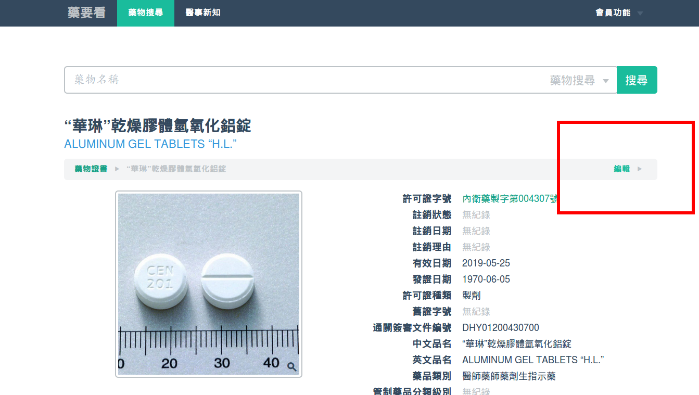
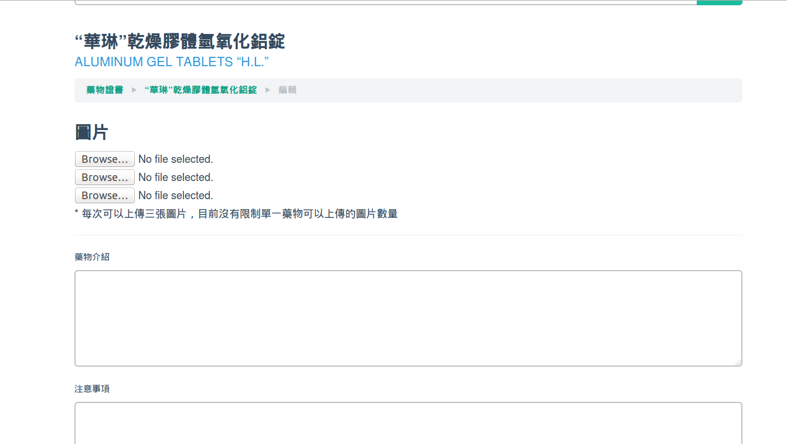
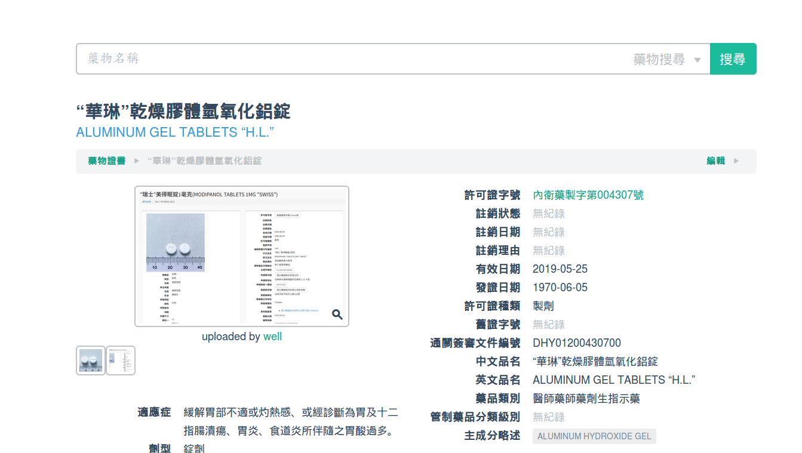
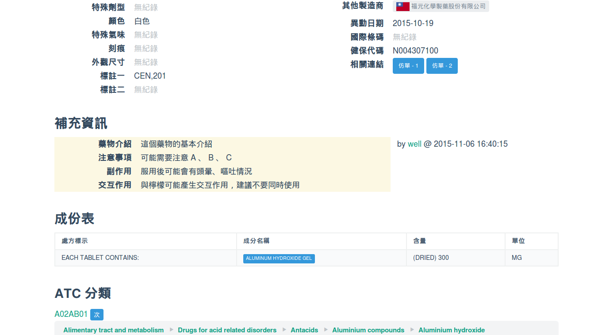

# 藥物資訊編輯功能

在會員登入後，檢視特定藥物時，在藥物名稱下方導覽列的最右邊，會看到一個編輯連結，點選後即可開始進行補充資訊的編輯

表單欄位說明如下：
* **圖片** 藥要看網站的圖片主要來自食藥署的公開資訊，不一定是最新狀態，透過這裡的圖片上傳功能可以提供手邊藥物的外觀樣貌。這裡的補充資訊並不希望做太多的限制，以編輯者最方便拍攝的方式即可，像是透過手機等。上傳後的圖片系統會自動調整尺寸，建議不要上傳太大的圖片檔案（像是單眼相機直接輸出的版本），因為最後產出的尺寸最大為 600x600 ，使用太大的圖片會浪費額外的等待時間。
* **藥物介紹** 主要是針對藥物治療的疾病或對象進行介紹，作為適應症文字的補充說明
* **注意事項** 藥物如果有特殊服用建議可以在此補充，關於副作用或是交互作用的部份建議可以放到下面兩個欄位
* **副作用** 藥物使用後如果會有一些預期的不良反應，可以在此補充說明
* **交互作用** 不同的藥物，或是藥物與特定食物如果有常見的交互作用情況，可以在此補充

表單送出後並不會立即更新，主要是網站為了因應大量的瀏覽在主機上設定了資料庫的快取，一段時間才會將最新的資訊放上網站；但編輯表單看到的資訊都是最新的，所以可以多次進行編輯。

上傳的圖片會與既有圖片並列顯示，點選小圖後會顯示較大圖片，圖片下方則是會標示提供圖片的作者，點選暱稱連結就會看到完整的個人資訊

補充的資訊會出現在基本資訊下方，內容的右邊則是會顯示編輯者暱稱，點選暱稱連結就會看到完整的個人資訊

為了避免編輯者之間的相互干擾，每個會員所編輯或上傳的內容都會獨立呈現，因此不用擔心會有覆蓋其他人成果的情況。上傳的圖片與補充資訊隨時可以進行編修，可以搭配其他會員提供的內容調整資訊。